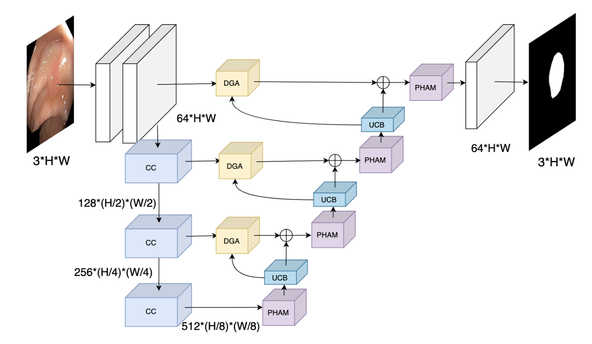

# FYPNet

FYPNet is my university graduation project. It is based on the current hybrid attention mechanism, where I designed the PHAM module by combining channel attention and spatial attention in a parallel manner to enhance the model’s segmentation performance.

# Architecture
Below is the architecture of the model I designed, which consists of several modules: 
<p align="center">

</p>
PHAM module architecture
<p align="center">

</p>
The ECAB and ESAB architecture diagrams are shown below
<p align="center">

</p>
For more details, you can refer to the code in the following files: 

[FYPNetBlock.py](model/FYPNet/FYPNetBlock.py) and [FYPNet.py](model/FYPNet/FYPNet.py)

# Result
Below are the results of my model evaluation. It turns out that our model has achieved relatively good results
<p align="center">

</p>


# FlameWork

Below is the table of contents of my project, along with the associated comments

```markdown
FYP/

    ├── Block                # Contains utility functions and core components of the project. 
    ├── configs              # Configuration files for model and experiment settings.
        └── config.yaml      # ** KEY config** 
    ├── Evaluate             # Scripts for model evaluation and performance assessment.
    ├── model                # Contains model definitions and architecture setups.
        ├── model_loader.py  # Control all model loading.
        ├── FYPNet           # Our model path
        └── <Other models..> 
    ├── LoadData             # Scripts for loading and preprocessing data.
        ├── data.py          # The data loading controller, which controls whether all datasets are loaded or not
        └── <Other code..>   # Other code, containing different dataset loading classes
    ├── params               # The training weights save the path.
    ├── test_model.py        # Script for testing the model.
    ├── todoList.py          # All of my tasks during the development of the project.
    ├── train_model.py       # Script for training the model.
    ├── requirements.txt     # File listing the required Python packages for the project.
    └── README.md            # Documentation file with setup instructions and project details.				

```
# Run

## Environment Configuration and Path Settings

```shell
#!/bin/bash
git clone git@github.com:scybl/FYP.git
cd FYP

# Define the directory names
DIRS=("saved_images" "params")

# Loop through the directory names
for DIR_NAME in "${DIRS[@]}"; do
  # Check if the directory exists
  if [ ! -d "$DIR_NAME" ]; then
    # Create the directory
    mkdir "$DIR_NAME"
    echo "Directory '$DIR_NAME' has been created."
  else
    echo "Directory '$DIR_NAME' already exists."
  fi
done

# Create the Conda environment
echo "Creating a Conda environment named 'FYPNet' with Python 3.10..."
conda create -n FYPNet python=3.10 -y

# Activate the newly created environment
echo "Activating the Conda environment 'FYPNet'..."
conda activate FYPNet

# Install required packages from requirements.txt
if [ -f "requirements.txt" ]; then
  echo "Installing dependencies from requirements.txt..."
  pip install -r requirements.txt
else
  echo "requirements.txt file not found!"
fi
```

## Dataset Preparation
In our training framework, we have prepared three datasets: [ISIC2018](https://challenge.isic-archive.com/landing/2018/), [CVC-ClinicDB](https://polyp.grand-challenge.org/CVCClinicDB/) and [Kvasir-SEG](https://datasets.simula.no/kvasir-seg/). You can click the links to visit the official websites and download the datasets.

## Dataset Path
If you need to change the path in the project after configuring the path, you need to modify it
change the [config.yaml](config/config.yaml) file to control the dataset path

After downloading the dataset, we need to split it into three parts: train, val, and test. Then change the dataset setting in [config.yaml](config/config.yaml).

## Train and Test
Because of the complete setup, you only need to run the following code to train and test
```shell
python train.py
python test.py
```
https://drive.google.com/drive/folders/1j1v-AHl-N4-CkMNwDtpf3QSvCdoipxuX?usp=drive_link